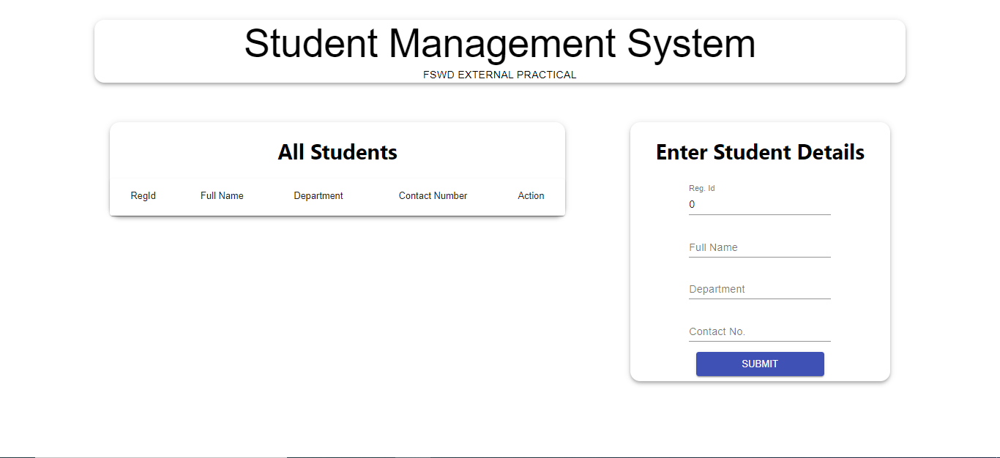
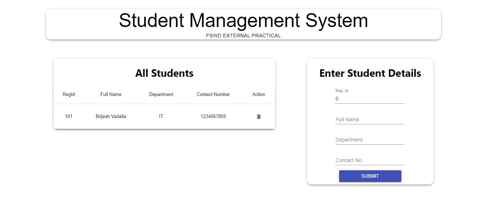

<!-- Social Links -->

[![LinkedIn][linkedin-shield]][linkedin-url]
[![Instagram][instagram-shield]][instagram-url]
[![Hashnode][hashnode-shield]][hashnode-url]


>


> 


> # All About `STUDENT MANAGEMENT SYSTEM FORM APP` 😎


## How to start
Fork the project download the code open your favorite IDE

1. Open terminal type command

``` 
npm i
```

2. Start the server

```
npm start
```

3. Split the terminal and type
```
cd client
```
``` 
npm i
```
```
npm start
```

># Designed With 😇
>## TECHNOLOGIES USED 
>


>## Making Use of Tools
>
>
>
>


# HERE IS THE PREVIEW HOW THIS PROJECT LOOKS😍


> 
> 


>## For any query you can reach out at brijeshvadaliya1@gmail.com I am happy to help 😎

# HAPPY LEARNING 🤩
>
>## Programming isn't about what you know; it's about what you can figure out.


<!-- Linkedin -->

[linkedin-shield]: https://img.shields.io/badge/-LinkedIn-black.svg?style=for-the-badge&logo=linkedin&colorB=0B5FBB
[linkedin-url]: https://www.linkedin.com/in/brijesh-vadaliya-16b3a2202/

<!-- Instagram -->

[instagram-shield]: https://img.shields.io/badge/Instagram-%23E4405F.svg?style=for-the-badge&logo=Instagram&logoColor=white
[instagram-url]: https://www.instagram.com/brijesh_vadaliya_8128/


<!-- Hashnode -->

[hashnode-shield]: https://img.shields.io/badge/Hashnode-2962FF?style=for-the-badge&logo=hashnode&logoColor=white
[hashnode-url]: https://brijeshvadaliya8128.hashnode.dev/


